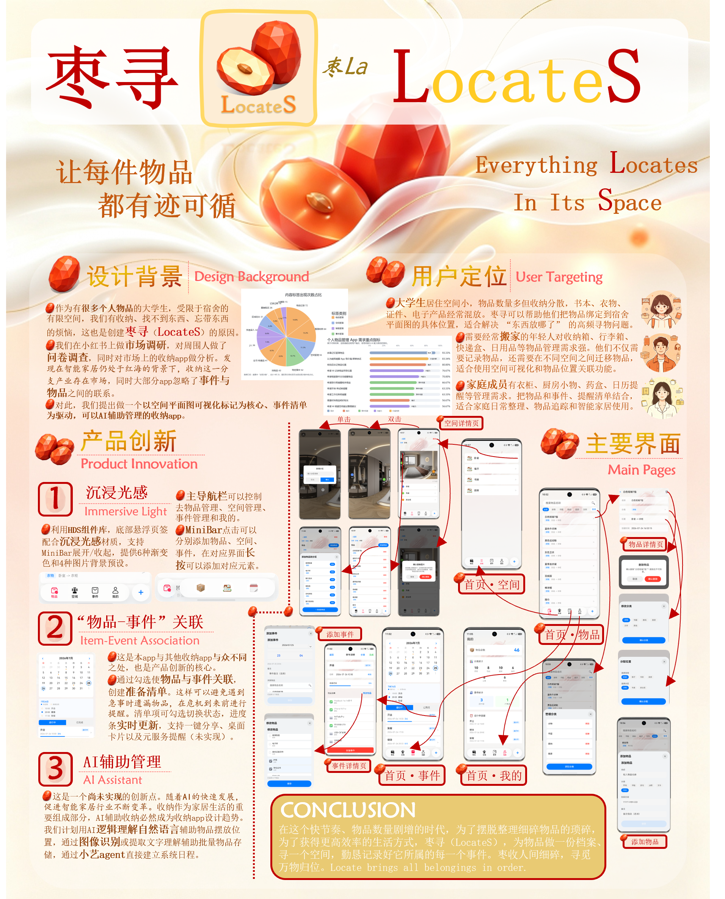
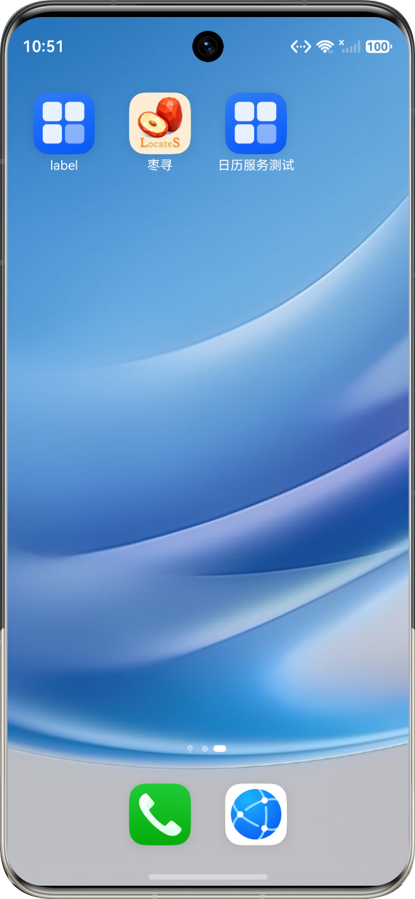
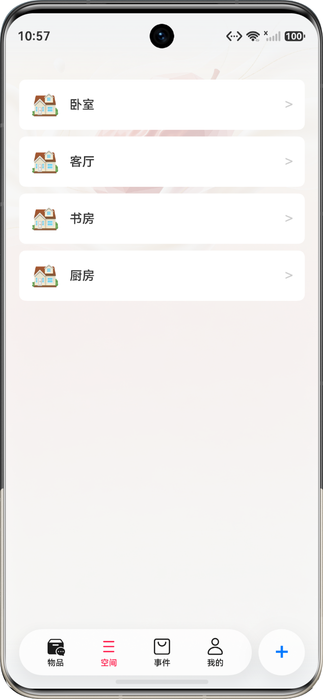
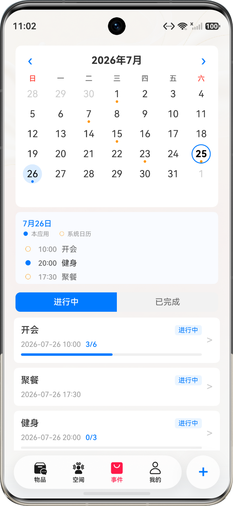
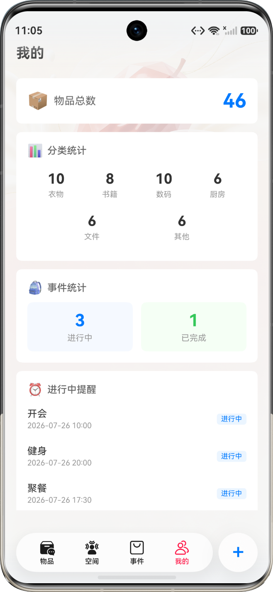

<p align="center">
  
</p>

<h1 align="center">枣寻（LocateS）· 智能收纳管家</h1>

<p align="center">
  <b>空间影像标记定位物品 · 事件清单驱动智能收纳提醒</b><br/>
  HarmonyOS 6.1 · ArkTS / ArkUI · HDS · RelationalStore
</p>

<p align="center">
  
  
  
  
</p>

> **《枣寻（LocateS）》** 是一款基于 HarmonyOS 的智能收纳管家 App，围绕「**物品记录 · 空间定位 · 事件提醒 · 沉浸体验**」，把 *东西放在哪* 和 *出门要带什么* 变成所见即所得。

## 📱 界面一览

<p align="center">
  
  
  
  
</p>

## 💡 项目简介

据艾瑞咨询，智能家居行业用户规模已达 **1.9 亿**，但应用场景单一、用户粘性持续下滑。社交平台与问卷调研显示：**93.33%** 的人依赖记忆管理物品，**80%** 曾「收拾完就忘记东西放哪」，**86.67%** 临近事件才想起准备物品。

市面上的收纳工具大多停留在「记名字 + 记分类」，缺少直观的定位手段，也没有把物品管理与生活事件联系起来。**枣寻（LocateS）** 以「**空间平面图可视化标记**」为核心、以「**事件准备清单**」为驱动，填补智能家居在收纳场景的空白，做所见即所得的智能收纳管家。

## ✨ 核心功能

### 📦 物品管理
- 多分类管理与**名称搜索**，支持**自定义分类**（衣物 / 书籍 / 数码 / 厨房 / 文件 / 其他 …）
- 物品可分配到具体空间位置，展示**层级化位置标签**

### 🗺️ 空间影像标记
- 上传 / 拍摄**空间平面图**，点击图片放置**彩色标记点**创建分区
- 物品关联至分区；支持**拖拽平移**、**双击全屏预览**，预览页可直接打点

### 📋 事件驱动清单
- 创建旅行 / 考试 / 搬家等事件，从物品库勾选所需物品，一键生成**准备清单**
- 清单项可勾选 / 取消，已完成项显示**删除线**，**进度条实时更新**；支持**一键分享**与标记完成

### 🗓️ 事件日历
- 日历视图展示事件标记，支持**系统日历导入**与待办日程同步

### 🎨 沉浸式界面
- 基于 **HDS（HarmonyOS Design System）**：顶部页签 + 底部**悬浮导航** + **沉浸光感材质**，MiniBar 展开 / 收起
- **6 种渐变色 + 4 种图片背景**预设，并支持从相册选择**自定义背景**
- 集成 **2×2 / 2×4 桌面服务卡片**，桌面直达「进行中的事件与待办清单」

## 🏗️ 技术栈

| 分类 | 选型 |
| ---- | ---- |
| 操作系统 | HarmonyOS 6.1（API 24，`targetSdkVersion 6.1.1(24)`） |
| 语言 / UI | ArkTS（严格模式）· ArkUI |
| 设计系统 | HDS（HarmonyOS Design System，沉浸光感材质） |
| 本地存储 | RelationalStore（`item` / `space` / `event` / `event_item` / `category` 五张表） |
| 系统能力 | 服务卡片（Form）· `systemShare` 分享 · 系统日历 |

## 🧩 系统架构

```
┌────────────────────────────────────────────────────────────┐
│  页面层 Pages   物品 / 空间 / 事件 / 我的 · 添加物品 · 详情  │
│                事件清单 · 空间预览打点 · 背景设置            │
├────────────────────────────────────────────────────────────┤
│  组件层 Components   ItemCard / EventCard / CategoryGrid    │
│                     日历视图 / 空状态 / 确认删除 / 页面背景    │
├────────────────────────────────────────────────────────────┤
│  数据层 Model + Repository + Database                       │
│            Item / Space / Event / Category / Background     │
│            Database 单例 — RelationalStore（5 张表）         │
├────────────────────────────────────────────────────────────┤
│  平台层  HarmonyOS 6.1 · ArkTS · ArkUI · HDS               │
│           systemShare · 服务卡片 · 系统日历                 │
└────────────────────────────────────────────────────────────┘
```

## 📂 项目结构

```text
.
├── AppScope/                         # 应用级配置与图标资源
├── entry/
│   └── src/main/ets/
│       ├── pages/                    # 路由页面（Index、详情、空间预览、背景设置等）
│       ├── tabs/                     # 首页四大 Tab（物品 / 空间 / 事件 / 我的）
│       ├── components/               # 卡片、分类网格、日历、空状态、页面背景等
│       ├── model/                    # 数据模型与建表 SQL
│       ├── data/                     # Database 单例 + 各 Repository + CalendarService
│       └── form/                     # 2×2 / 2×4 桌面服务卡片
├── docs/                             # 文档、调研图表、海报、界面截图与交付物
├── hvigor/                           # Hvigor 构建配置
├── build-profile.json5
├── hvigorfile.ts
└── oh-package.json5
```

## 核心页面

- `pages/Index`：应用入口，包含物品、空间、事件与我的页面导航。
- `tabs/ItemPage`：物品列表、搜索、分类筛选、快速添加入口。
- `tabs/SpacePage`：空间列表与层级管理、空间影像标记。
- `tabs/EventPage`：事件列表、日历视图、事件创建入口。
- `pages/ItemDetailPage`：物品详情与删除。
- `pages/EventDetailPage`：事件详情、物品准备清单、进度与分享。
- `pages/ProfilePage`：个人主页、统计信息与背景设置入口。


